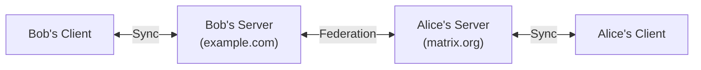

# What is Matrix?

Matrix is an open standard for secure, decentralised messaging that puts you in control. Unlike
WhatsApp or Discord, you can run your own server, choose who hosts your data, and still chat with
anyone on the network.

This open technology powers text messaging, voice and video calls, and can connect to many other
platforms - all while keeping your conversations private and under your control.

## How it works

In this example, Bob and Alice use different servers but can still chat seamlessly. Messages travel
from Bob's device to his server (example.com), then to Alice's server (matrix.org), and finally to
her device within milliseconds of Bob hitting send.

This approach means:

- You control your own data
- No single company owns the entire network
- You can use your own domain name
- You choose who can contact you

## The communication network

Since 2014, the network has grown organically to include millions of users across the world. It
connects many platforms and services, breaking down the walls between traditional communication silos.

What I find most valuable about it:

- **User ownership**: Having control over my data, identity and communications
- **Federation**: The way servers connect with each other creates resilience
- **End-to-end encryption**: Knowing private conversations stay private
- **Open source**: The transparency of open code encourages trust and innovation
- **Connections**: Being able to chat with people regardless of their platform

There's ongoing work to make everything better, from smoother peer-to-peer messaging to more reliable
group calls and broader connections to other services. There's a lot of possibility in the future.

## My participation

I help moderate several chat rooms and contribute to projects in this community. In particular,
I run the [#space:tomfos.tr](https://matrix.to/#/#space:tomfos.tr) space, which contains several
rooms from technical discussions to jokes and other chat.

You can see my projects on [GitHub](https://github.com/tcpipuk), and learn about my community is
governed on the [Community page](../community.md).

## Useful resources

If you're curious to learn more:

- **[Matrix.org Foundation](https://matrix.org/)**: The non-profit that stewards the standard
- **[Technical Specification](https://spec.matrix.org/latest/)**: The actual technical definition of
  how it all works
- **[This Week In Matrix](https://matrix.org/category/this-week-in-matrix/)**: A weekly roundup of
  what's happening full of user/project submitted posts from around the ecosystem

The guides in the subsections below cover setting up and configuring server software like
Continuwuity and Synapse, as well as LiveKit for voice and video calling.
